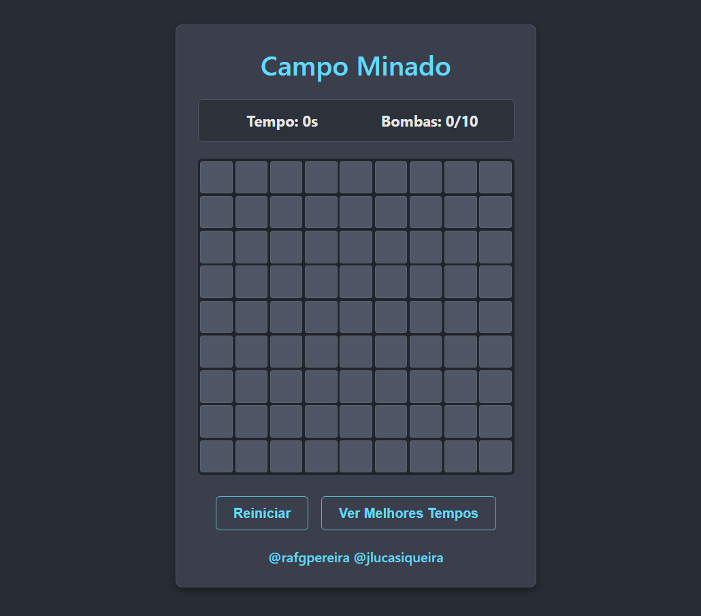
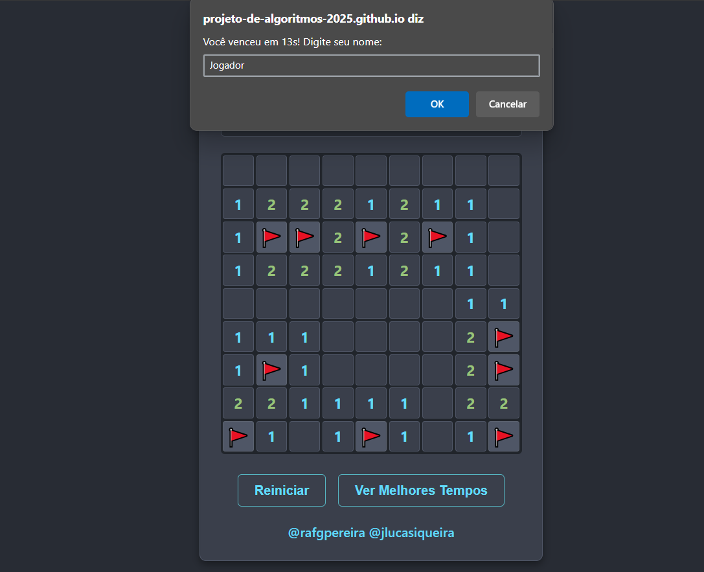
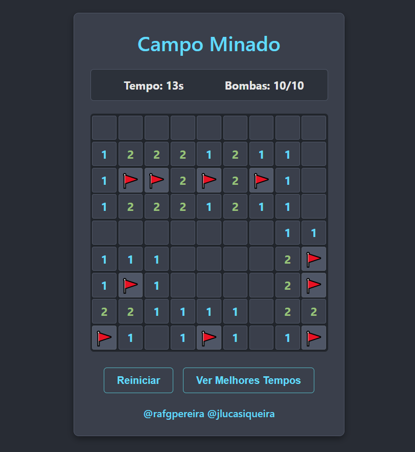
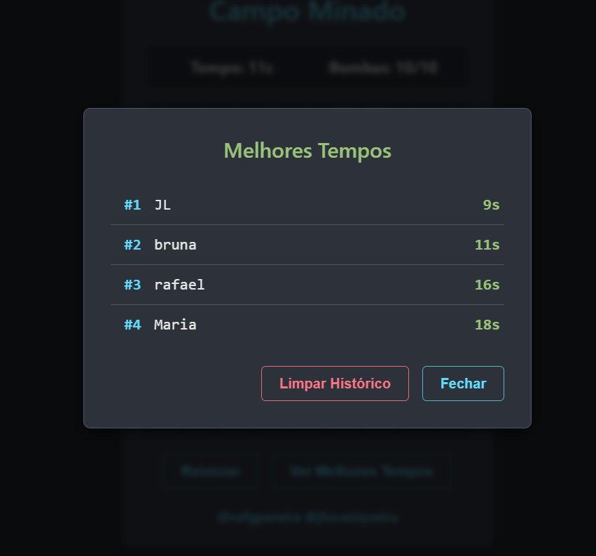

# NomedoProjeto

**Número da Lista**: X 
**Conteúdo da Disciplina**: Grafos 1 

## Alunos
|Matrícula | Aluno |
| -- | -- |
| 222015248  |  Rafael Gomes Pereira |
| 222025324  |  João Lucas Araujo Siqueira |

## Sobre 
O projeto implementa uma versão do jogo campo minado, utilizando uma BFS para abrir os campos com valor zero adjacentes ao selecionado, ideia semelhante ao Flood Fill.

## Screenshots

  
   
  Captura de tela da interface principal

  
   
  Captura de tela da interface quando se vence o jogo

  
   
  Captura de tela da interface da tabela preenchida

  
   
  Captura de tela da interface da tabela de pontuação

  
   
  Captura de tela da interface da derrota na partida

## Instalação 
**Linguagem**: Javascript, HTML e CSS 
**Framework**: Não foi utilizado 
Para executar este projeto de Campo Minado, o único requisito é ter um navegador web moderno instalado no seu computador. 

## Uso 
Apenas clique no link disponível no campo "about" do repositório no GitHub e divirta-se 🎉

## Outros 
Quaisquer outras informações sobre seu projeto podem ser descritas abaixo.

